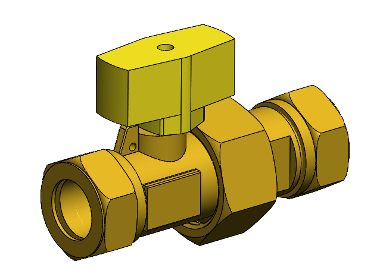

# Defining the problem

As talked about in the intro, a gas valve needs to be assembled. We can use an ABB IRB120 industrial robot to achieve this.

The valve consists of:
- Closing rings
- Nuts
- An extension part
- Rubber rings
- The main body
- A knob

## The goal
The focus during this project is on the process of achieving this goal, and the safety of the operators.

## Our Git workflow
During the project we used Git to collaborate on the different subjects. If a group member changed something, a pull request was made.

As we (more than one group member) verbally agreed on the change, the pull request was merged into the main branch.