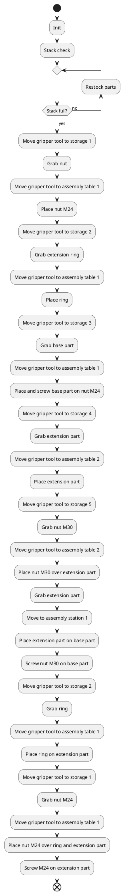
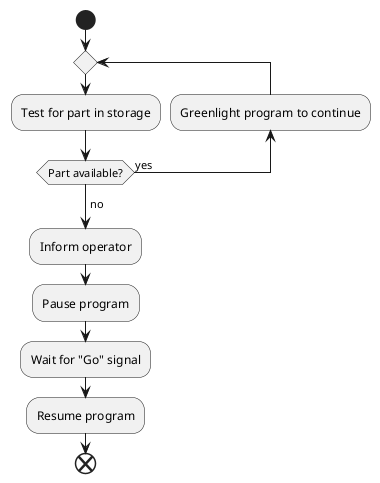

### Activity diagrams

An activity diagram is a flowchart that shows activities done by a system. This is ours of the system:

```plantuml

@startuml
start

:Init;
:Stack check;
repeat
backward:Restock parts;
repeat while (Stack full?) is (no)
->yes;
:Move gripper tool to storage 1;
:Grab nut;
:Move gripper tool to assembly table 1;
:Place nut M24;
:Move gripper tool to storage 2;
:Grab extension ring;
:Move gripper tool to assembly table 1;
:Place ring;
:Move gripper tool to storage 3;
:Grab base part;
:Move gripper tool to assembly table 1;
:Place and screw base part on nut M24;
:Move gripper tool to storage 4;
:Grab extension part;
:Move gripper tool to assembly table 2;
:Place extension part;
:Move gripper tool to storage 5;
:Grab nut M30;
:Move gripper tool to assembly table 2;
:Place nut M30 over extension part;
:Grab extension part;
:Move to assembly station 1;
:Place extension part on base part;
:Screw nut M30 on base part;
:Move gripper tool to storage 2;
:Grab ring;
:Move gripper tool to assembly table 1;
:Place ring on extension part;
:Move gripper tool to storage 1;
:Grab nut M24;
:Move gripper tool to assembly table 1;
:Place nut M24 over ring and extension part;
:Screw M24 on extension part;

end

@enduml

```

## Activity in case of an empty storage

```plantuml

@startuml
start

repeat
    :Test for part in storage;

backward :Greenlight program to continue;
repeat while (Part available?) is (yes)
->no;
:Inform operator;
:Pause program;
:Wait for "Go" signal;
:Resume program;

end
@enduml
```