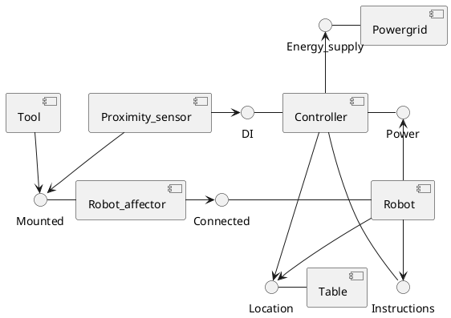

# Interface diagram

This is the interface diagram. The interface diagram shows the way parts of the setup interact with eacht other.

```plantuml
@startuml IA v0

[Proximity_sensor]
[Tool]
[Robot_affector]
[Robot]
[Controller]
[Table]
[Powergrid]

Location - Table

Controller ---> Location
Controller - Power

Energy_supply <-- Controller
Energy_supply - Powergrid

Mounted - Robot_affector
Robot -> Location
Power <-- Robot

Robot_affector -> Connected
Proximity_sensor --> Mounted
Connected - Robot

Tool --> Mounted
Proximity_sensor -> DI
DI - Controller

Robot --> Instructions
Instructions - Controller

@enduml
```