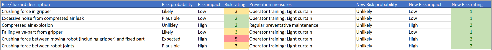

# Safety
## Performance levels (PL)
The performance level (PL) of an electrical component is defined as the probability of a dangerous failure per hour. The PL's range from ```PLa``` to ```PLe```, where ```PLa``` has the highest chance of failing.

## Risk assesssment
To determine how well we need to guard our set-up, we did a risk assessment:

The highest value in the most right column is ```2```, which corresponds to Safety Integrity Level 2, which corresponds to Performance Level d. This means that every electrical safety element in this setup must be at least PLd.