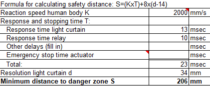

## Light curtains
We decided to use a light curtain to make our setup safe for the operators involved. Choosing a light curtain is not as straightforward as one might think. You need to meet the minimum performance level, and the stopping time of the protected setup is important to be able to calculate the minimum distance of the light curtain to the danger zone. This can be done with the help of norms.

### EN-ISO 13855:2010
This norm has the guidelines for the minimum distance of light curtains to danger zones. Our calculations can be found below.

This means that our light curtains need to be at least 206 mm from our robot while the robot reaches out as far as it can.