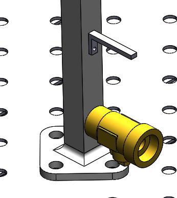
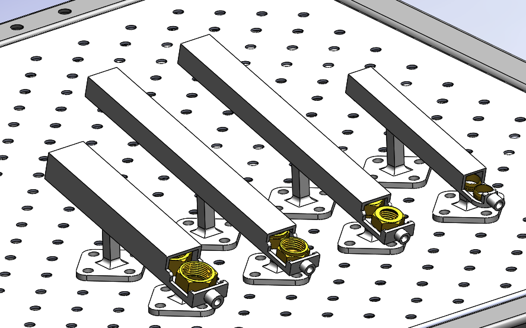
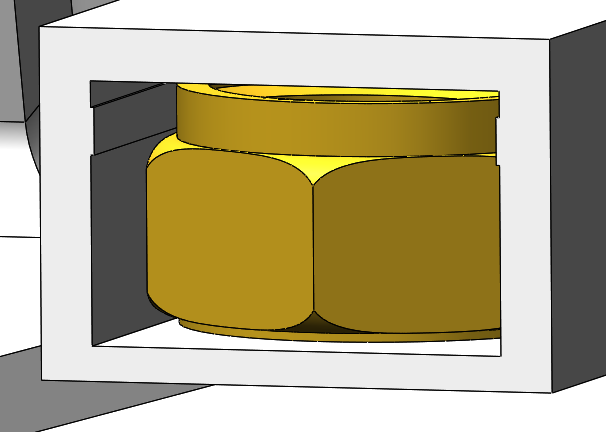
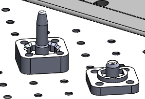
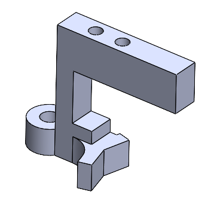

# Implementation
Below, the designed setup can be seen (the light curtain and robot are not shown).

## The parts of the implementation
### The main body magazine

The magazine for the main body is a tree-like magazine. the operator can put up to 5 main bodies in the magazine. The orientation of the part is important. The sensor on the gripper checks for the availability of the part.

The same goes for the extension part of the valve.

### The other magazines

The other magazines are simple magazines that rely on gravity. If the first available part gets picked by the robot, the gravity will push the next part to the pickup point.

To make the filling of these magazines error free, we designed the entrance of the magazines with [Poka-yoke](https://en.wikipedia.org/wiki/Poka-yoke) in mind. Poka-yoke means error proofing in Japanese and is the term used for thinking about solutions with error prevention in mind. It can be seen in the picture below. The nut cannot be inserted any other way than the correct way.

### The fixtures

These fixtures are used by the robot to assemble the final valve. Nuts can be placed in them, which allows the robot to screw the main body in it. Rotation of the nut is prevented by design, the robot moves the main body and the extension part. Finally, the two semi-finished products are put together.

### The gripper

The gripper was the hardest part to design of the project. We wanted to design a gripper that could hold all necessary parts used in the valve assembly with the same travel length of the used gripper cylinder. This costed a bit of time, but was definitely worth it, as no gripper change station is required. These tend to cause headaches.

Above you can see one side of the gripper. It is the part which houses the sensor to check the magazines as well.

## Time-displacement diagrams
We do not have any actuators apart from the robot, so no time-displacement diagrams for this project.

## The setup in action
Due to known unforeseen circumstances of this course, we currently can not show a working setup. However, a simulation video is coming.

## Review of implementation process
The implementation process is ongoing.

## Future improvements
In the future, we would like to have more conversation with the supervising lecturer to see if we are going in the right direction. Also a more structured way of dividing actual lectures and "working" lectures would benefit us greatly.

Besides that, a fixed robot setup, available at any given time during the minor would have had the greatest impact. 