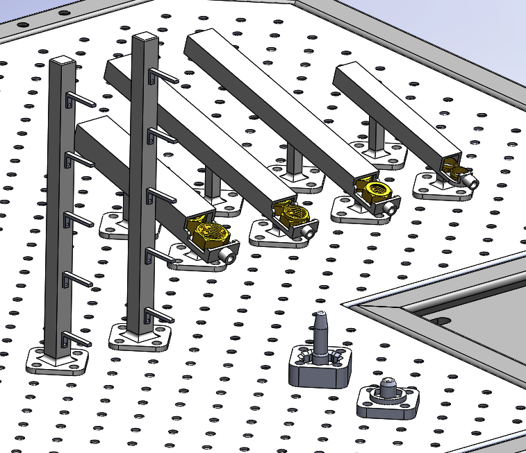

# Implementation
Below, the designed setup can be seen (the light curtain is not shown).

The tree-like parts are the stock for the main bodies and the extension parts. The slides on the top side of the picture are for the nuts and the rings. The two parts on the bottom of the picture are acting as jigs for the assembly of the valves.

## Time-displacement diagrams
We do not have any actuators apart from the robot, so no time-displacement diagrams for this project.
 
## The setup in action
Due to known unforeseen circumstances of this course, we currently can not show a working setup. However, a simulation video is coming.

## Reflection